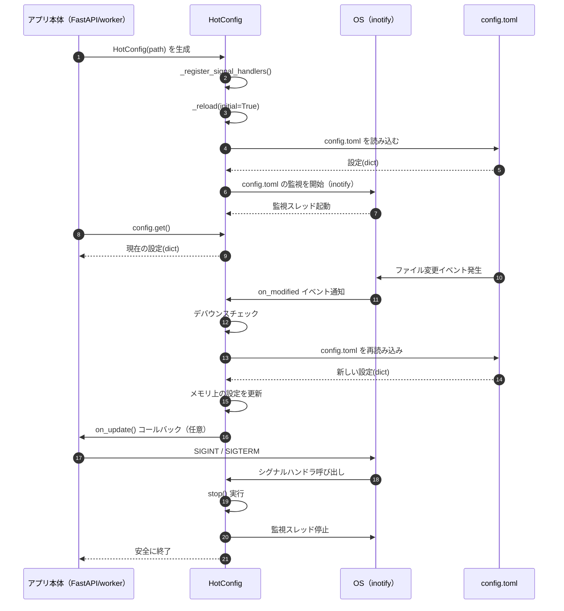

# config サブパッケージについて

このディレクトリは、アプリ全体で使う **設定ファイル（config.toml）を安全に読み込むための仕組み**をまとめたものです。

FastAPI（storage_server）、worker、CLI ツールなど、  
どのコンポーネントからでも **同じ設定を共有**できます。

---

# 🎯 目的

- `config.toml` を **アプリ起動中に変更しても即時反映**したい  
- 設定は毎回ファイルを読むのではなく **メモリから高速に取得**したい  
- TOML が壊れていたら **前回の設定を維持（ロールバック）**したい  
- Linux / WSL の **inotify を使って軽量に監視**したい  
- Ctrl+C や systemd stop で **安全に終了**したい  

これらを実現するために、`HotConfig` クラスを使っています。

---

# 📁 ディレクトリ構成

```
app/
  config/
    hot_config.py   ← 設定のホットリロード本体
    loader.py       ← アプリ全体で共有する config インスタンス
    README.md       ← このファイル
  config.toml       ← 設定ファイル
```

---

# 🔥 HotConfig の仕組み（ざっくり理解）

HotConfig は Linux の **inotify** を使って  
`config.toml` の変更を監視しています。

- 設定ファイルが変更されると OS がイベントを送ってくる  
- そのときだけ TOML を読み直す  
- 読み込みに失敗したら前回の設定を維持  
- 設定は常にメモリにキャッシュされているので高速  

つまり、**アプリを止めずに設定を変えられる**仕組みです。

---



---

# 🧩 loader.py の役割

`loader.py` はアプリ全体で共有する **config インスタンス**を作るだけのファイルです。

```python
from pathlib import Path
from .hot_config import HotConfig

CONFIG_PATH = Path(__file__).resolve().parent.parent / "config.toml"

config = HotConfig(path=CONFIG_PATH)
```

どのコンポーネントでも

```python
from app.config.loader import config
```

と書けば、同じ設定を参照できます。

---

# 🧪 使い方（storage_server / worker / CLI 共通）

## 設定を読む

```python
from app.config.loader import config

cfg = config.get()
print(cfg["app"]["version"])
```

## FastAPI（storage_server）での統合（FastAPI 2.x）

FastAPI 2.x では `on_event` が非推奨なので、  
**lifespan** を使います。

```python
from fastapi import FastAPI
from contextlib import asynccontextmanager
from app.config.loader import config

@asynccontextmanager
async def lifespan(app: FastAPI):
    yield
    config.stop()  # 安全に終了

app = FastAPI(lifespan=lifespan)
```

## worker の場合

```python
from app.config.loader import config

try:
    while True:
        cfg = config.get()
        do_work(cfg)
finally:
    config.stop()
```

---

# 🧠 なぜ stop() が必要なのか？

HotConfig は内部で **監視スレッド**を動かしています。

- Ctrl+C（SIGINT）
- systemd stop / docker stop（SIGTERM）

を受けたときに自動で stop() が呼ばれるようになっていますが、  
**念のため finally で stop() を呼ぶのが本番運用では安全**です。

stop() を呼ばなくてもプロセス終了時にスレッドは死にますが、  
ログやリソース解放のために stop() を呼ぶのがベストです。

---

# 🐧 対応 OS について

この仕組みは **Linux / WSL 専用**です。

Windows ネイティブでは動作保証していません。  
（Windows のファイル監視は挙動が不安定なため）

開発環境は **WSL を使うことを推奨**します。

---

# 🎯 まとめ

- `config.toml` をリアルタイムで反映できる  
- 設定は常にメモリから高速に取得  
- TOML が壊れてもロールバック  
- Linux / WSL で軽量に動作  
- Ctrl+C や systemd stop で安全に終了  

アプリ全体の設定管理を **安全・高速・シンプル**にするための仕組みです。

```

---
