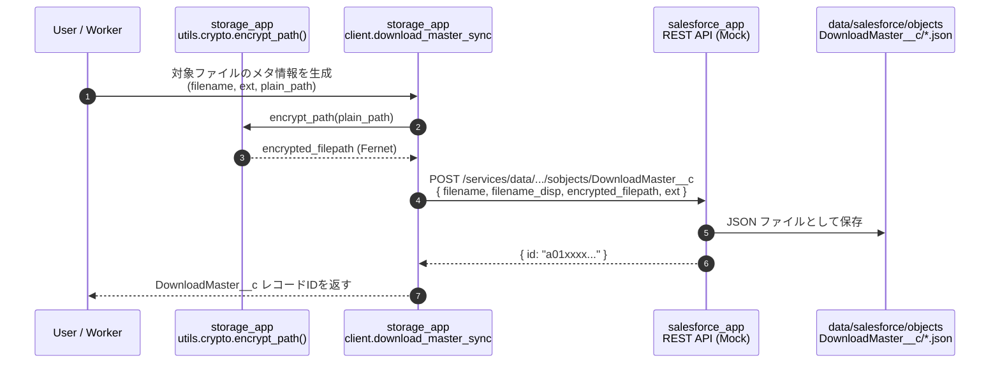

# 🔐 ファイルパス暗号化 → Salesforce DownloadMaster__c 登録までのシーケンス図



---

# 📝 補足説明

## 🔐 1. ファイルパスの暗号化（storage_app/utils/crypto.py）
- AES-GCM で **絶対パスを暗号化**
- Salesforce 側には **復号できない文字列**だけ渡す
- 復号は storage_app 側だけが可能

例：
```python
encrypted = encrypt_path("data/storage/data/file_1.csv")
```

---

## 📤 2. DownloadMaster__c レコード作成（storage_app/client/download_master_sync.py）
暗号化済みパスを含む JSON を Salesforce Mock API に送信：

```json
{
  "filename": "file_1.csv",
  "filename_disp": "file_1.csv",
  "encrypted_filepath": "gAAAAABl....",
  "ext": "csv"
}
```

---

## 🗂 3. Salesforce 側で JSON 保存（data/salesforce/objects/DownloadMaster__c）
- 1 レコード = 1 JSON ファイル
- LWC のダウンロード画面はこの JSON を読み込んで一覧表示

